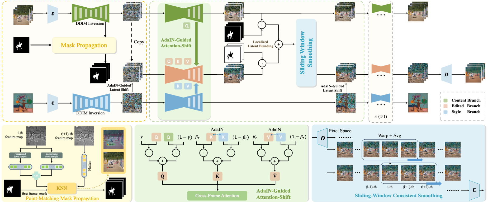

<div align="center">
<h1>
UniVST: A Unified Framework for Training-free Localized Video Style Transfer [Official Code of PyTorch]
</h1>

<div>
    <a href='https://github.com/QuanjianSong' target='_blank' style='text-decoration:none'>Quanjian Song<sup>1</sup></a>, &ensp;
    <a href='https://scholar.google.com/citations?hl=zh-CN&user=Dp3L1bsAAAAJ' target='_blank' style='text-decoration:none'>Mingbao Lin<sup>2</sup></a>, &ensp;
    <a href='https://scholar.google.com/citations?hl=zh-CN&user=nnF1s7kAAAAJ' target='_blank' style='text-decoration:none'>Wengyi Zhan<sup>1</sup></a>, &ensp;
    <a href='https://scholar.google.com/citations?user=DNuiPHwAAAAJ&hl=zh-CN&oi=ao' target='_blank' style='text-decoration:none'> Shuicheng Yan<sup>2</sup></a>, &ensp;
    <a href='https://mac.xmu.edu.cn/ljcao/' target='_blank' style='text-decoration:none'>Liujuan Cao<sup>1,†</sup></a>, &ensp;
    <a href='https://mac.xmu.edu.cn/rrji/' target='_blank' style='text-decoration:none'>Rongrong Ji<sup>1</sup></a>
</div>

<div>
    <sup>1</sup> Key Laboratory of Multimedia Trusted Perception and Efficient Computing, <br> Ministry of Education of China, Xiamen University, China.
    <br>
    <sup>2</sup> Kunlun Skywork AI.  &ensp;
    <sup>†</sup> Corresponding Author.
</div>

<sub></sub>

<p align="center">
    <span>
        <a href="https://arxiv.org/pdf/2410.20084" target="_blank"> 
        </a> &emsp;  &emsp; 
    </span>
    <span> 
        <a href='https://quanjiansong.github.io/projects/UniVST' target="_blank">
        </a>  &emsp;  &emsp;
    </span>
    <span> 
        <a href='https://huggingface.co/papers/2410.20084' target="_blank"> 
        </a> &emsp;  &emsp;
    </span>
</p>
</div>

## 🎉 News
<pre>
• <strong>2025.10</strong>: 🔥 UniVST now supports five backbones, including advanced rectified-flow models.
• <strong>2025.09</strong>: 🔥 The code has been reorganized and several bugs have been fixed.
• <strong>2025.05</strong>: 🔥 The <a href="https://quanjiansong.github.io/projects/UniVST">project page</a> of UniVST is now available.
• <strong>2025.01</strong>: 🔥 The official code of UniVST has been released.
• <strong>2024.10</strong>: 🔥 The paper of UniVST has been submitted to <a href="https://arxiv.org/abs/2410.20084">arXiv</a>.
</pre>

## 🎬 Overview
We propose UniVST, a unified framework for training-free localized video style transfer based on diffusion models. UniVST first applies DDIM inversion to the original video and style image to obtain their initial noise and integrates Point-Matching Mask Propagation to generate masks for the object regions. It then performs AdaIN-Guided Localized Video Stylization with a three-branch architecture for information interaction. Moreover, Sliding-Window Consistent Smoothing is incorporated into the denoising process, enhancing the temporal consistency in the latent space. The overall framework is illustrated as follows:


## 🔧 Environment
```
git clone https://github.com/QuanjianSong/UniVST.git
# Installation with the requirement.txt
conda create -n UniVST python=3.9
conda activate UniVST
pip install -r requirements.txt
# Or installation with environment.yaml
conda env create -f environment.yaml
```

## 🚀 Start
We provide five different backbone options: SD-v1.5, SD-v2.1, Animatediff-v2, SD-v3.0, and SD-v3.5. You can freely choose the backbone for your video stylization tasks.

<details>
<summary>SD-v1.5/SD-v2.1</summary>

You can run with a single click `sh scripts/start_sd.sh` to get the stylized results. Alternatively, you can also follow the steps below for customization.

#### • 1.Perform inversion for original video.
```
CUDA_VISIBLE_DEVICES=1 python src/sd/run_content_inversion_sd.py \
                        --content_path examples/content/mallard-fly \
                        --output_path results/content-inv \
                        --is_opt
```
Then, you will find the content inversion result in the `results/content-inv/sd/mallard-fly`.
#### • 2.Perform inversion for style image.
```
CUDA_VISIBLE_DEVICES=1 python src/sd/run_style_inversion_sd.py \
                        --style_path examples/style/00033.png \
                        --output_path results/style-inv
```
Then, you will find the style inversion result in the `results/style-inv/sd/00033`.
#### • 3.Perform mask propagation. [Optional, you can also customize the masks and skip this step.]
```
CUDA_VISIBLE_DEVICES=1 python src/mask_propagation.py \
                        --feature_path results/content-inv/sd/mallard-fly/features/inversion_feature_map_2_block_301_step.pt \
                        --backbone 'sd' \
                        --mask_path 'examples/mask/mallard-fly.png' \
                        --output_path 'results/masks'
```
Then, you will find the mask propagation result in the `results/masks/sd/mallard-fly`.
#### • 4.Perform video style transfer. [Optional, you can also omit the mask_path to complete the overall style transfer.]
```
CUDA_VISIBLE_DEVICES=1 python src/sd/run_video_style_transfer_sd.py \
                        --content_inv_path results/content-inv/sd/mallard-fly/inversion \
                        --style_inv_path results/style-inv/sd/00033/inversion \
                        --mask_path results/masks/sd/mallard-fly \
                        --output_path results/stylization
```
Then, you will find the stylization result in the `results/stylization/sd/mallard-fly_00033`.

</details> 


<details>
<summary>Animatediff-v2</summary>

You can run with a single click `sh scripts/start_animatediff.sh` to get the stylized results. Alternatively, you can also follow the steps below for customization.

#### • 1.Perform inversion for original video.
```
CUDA_VISIBLE_DEVICES=1 python src/animatediff/run_content_inversion_animatediff.py \
                        --content_path examples/content/mallard-fly \
                        --output_path results/content-inv \
                        --is_opt
```
Then, you will find the content inversion result in the `results/content-inv/animatediff/mallard-fly`.
#### • 2.Perform inversion for style image.
```
CUDA_VISIBLE_DEVICES=1 python src/animatediff/run_style_inversion_animatediff.py \
                        --style_path examples/style/00033.png \
                        --output_path results/style-inv \
```
Then, you will find the style inversion result in the `results/style-inv/animatediff/00033`.
#### • 3.Perform mask propagation. [Optional, you can also customize the masks and skip this step.]
```
CUDA_VISIBLE_DEVICES=1 python src/mask_propagation.py \
                        --feature_path results/content-inv/animatediff/mallard-fly/features/inversion_feature_map_2_block_301_step.pt \
                        --backbone 'animatediff' \
                        --mask_path 'examples/mask/mallard-fly.png' \
                        --output_path 'results/masks'
```
Then, you will find the mask propagation result in the `results/masks/animatediff/mallard-fly`.
#### • 4.Perform video style transfer. [Optional, you can also omit the mask_path to complete the overall style transfer.]
```
CUDA_VISIBLE_DEVICES=1 python src/animatediff/run_video_style_transfer_animatediff.py \
                        --content_inv_path results/content-inv/animatediff/mallard-fly/inversion \
                        --style_inv_path results/style-inv/animatediff/00033/inversion \
                        --mask_path results/masks/animatediff/mallard-fly \
                        --output_path results/stylization
```
Then, you will find the stylization result in the `results/stylization/animatediff/mallard-fly_00033`.

</details> 


<details>
<summary>SD-v3.0/SD-v3.5</summary>

You can run with a single click `sh scripts/start_sd3.sh` to get the stylized results. Alternatively, you can also follow the steps below for customization.

#### • 1.Perform inversion for original video.
```
CUDA_VISIBLE_DEVICES=1 python src/sd3/run_content_inversion_sd3.py \
                        --content_path examples/content/mallard-fly \
                        --output_path results/content-inv \
                        --is_rf_solver
```
Then, you will find the content inversion result in the `results/content-inv/sd3/mallard-fly`.
#### • 2.Perform inversion for style image.
```
CUDA_VISIBLE_DEVICES=1 python src/sd3/run_style_inversion_sd3.py \
                        --style_path examples/style/00033.png \
                        --output_path results/style-inv \
                        --is_rf_solver # use rf_solver
```
Then, you will find the style inversion result in the `results/style-inv/sd3/00033`.
#### • 3.Perform mask propagation. [Optional, you can also customize the masks and skip this step.]
```
CUDA_VISIBLE_DEVICES=1 python src/mask_propagation.py \
                        --feature_path results/content-inv/sd3/mallard-fly/features/inversion_feature_map_2_block_301_step.pt \
                        --backbone 'sd3' \
                        --mask_path 'examples/mask/mallard-fly.png' \
                        --output_path 'results/masks'
```
Then, you will find the mask propagation result in the `results/masks/sd3/mallard-fly`.
#### • 4.Perform video style transfer. [Optional, you can also omit the mask_path to complete the overall style transfer.]
```
CUDA_VISIBLE_DEVICES=1 python src/animatediff/run_video_style_transfer_animatediff.py \
                        --content_inv_path results/content-inv/animatediff/mallard-fly/inversion \
                        --style_inv_path results/style-inv/animatediff/00033/inversion \
                        --mask_path results/masks/animatediff/mallard-fly \
                        --output_path results/stylization
```
Then, you will find the stylization result in the `results/stylization/sd3/mallard-fly_00033`.

</details> 


## 🎓 Bibtex
🤗 If you find this code helpful for your research, please cite:
```
@article{song2024univst,
  title={UniVST: A Unified Framework for Training-free Localized Video Style Transfer},
  author={Song, Quanjian and Lin, Mingbao and Zhan, Wengyi and Yan, Shuicheng and Cao, Liujuan and Ji, Rongrong},
  journal={arXiv preprint arXiv:2410.20084},
  year={2024}
}
```
