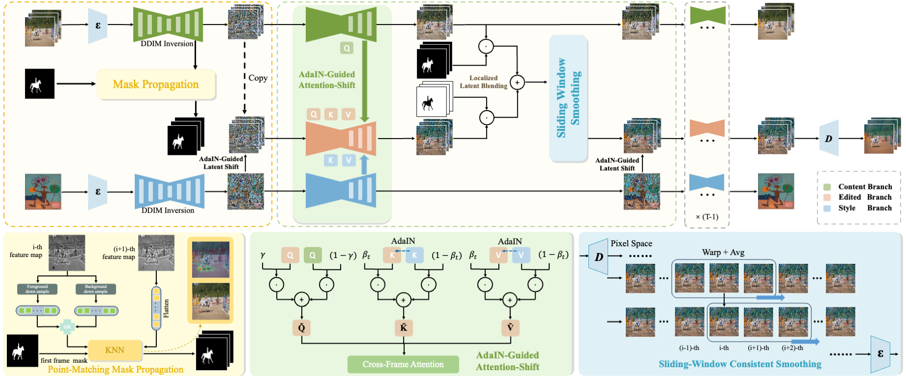

<div align="center">
<h1>
UniVST: A Unified Framework for Training-free Localized Video Style Transfer [Official Code of PyTorch]
</h1>

<div>
    <a href='https://github.com/QuanjianSong' target='_blank' style='text-decoration:none'>Quanjian Song<sup>1</sup></a>, &ensp;
    <a href='https://scholar.google.com.hk/citations?hl=zh-CN&user=nnF1s7kAAAAJ' target='_blank' style='text-decoration:none'>Mingbao Lin<sup>2</sup></a>, &ensp;
    <a href='https://scholar.google.com/citations?hl=zh-CN&user=P9ctuRUAAAAJ&view_op=list_works&sortby=pubdate' target='_blank' style='text-decoration:none'>Wengyi Zhan<sup>1</sup></a>, &ensp;
    <a href='https://scholar.google.com.hk/citations?user=DNuiPHwAAAAJ&hl=zh-CN&oi=ao' target='_blank' style='text-decoration:none'> Shuicheng Yan<sup>2</sup></a>, &ensp;
    <a href='https://mac.xmu.edu.cn/ljcao/' target='_blank' style='text-decoration:none'>Liujuan Cao<sup>1,†</sup></a>, &ensp;
    <a href='https://mac.xmu.edu.cn/rrji/' target='_blank' style='text-decoration:none'>Rongrong Ji<sup>1</sup></a>
</div>

<div>
    <sup>1</sup> Key Laboratory of Multimedia Trusted Perception and Efficient Computing, <br> Ministry of Education of China, Xiamen University, China.
    <br>
    <sup>2</sup> Kunlun Skywork AI.  &ensp;
    <sup>†</sup> Corresponding Author.
    
</div>

<sub></sub>

<p align="center">
    <span>
        <a href="https://arxiv.org/pdf/2410.20084" target="_blank"> 
        </a> &emsp;  &emsp; 
    </span>
    <span> 
        <a href='https://quanjiansong.github.io/projects/UniVST' target="_blank">
        </a>  &emsp;  &emsp;
    </span>
    <span> 
        <a href='https://huggingface.co/papers/2503.06508' target="_blank"> 
        </a> &emsp;  &emsp;
    </span>
</p>
</div>

## News
- **2024.10.26**: 🔥 The paper of UniVST has been submitted to [arXiv](https://arxiv.org/abs/2410.20084).
- **2025.01.01**: 🔥 The official code of UniVST has been released.

## 0. Project Introduction

This is the official implementation of "UniVST: A Unified Framework for Training-free Localized Video Style Transfer". It operates without the need for training, offering a distinct advantage over existing methods that transfer style across entire videos. 

## 1. Environment Configuration
```
git clone https://github.com/QuanjianSong/UniVST.git
```
#### 1.1 Installation with the requirement.txt
```
conda create -n UniVST python=3.9
conda activate UniVST
pip install -r requirements.txt
```
#### 1.2 Installation with environment.yaml
```
conda env create -f environment.yaml
```

## 2. Quick Start
#### 2.1 Perform inversion for original video.
```
python content_ddim_inv.py --content_path ./example/content/libby \
                            --output_dir ./output
```
Then, you will find the content inversion result in the `./output/content`.
#### 2.2 Perform mask propagation.
```
python mask_propagation.py --feature_path ./output/features/libby/inversion_feature_301.pt \
                            --mask_path ./example/mask/libby.png \
                            --output_dir ./output
```
Then, you will find the mask propagation result in the `./output/mask`.
#### 2.3 Perform inversion for style image.
```
python style_ddim_inv.py --style_path ./example/style/style1.png \
                            --output_dir ./output
```
Then, you will find the style inversion result in the `./output/style`.
#### 2.4 Perform video style transfer.
```
python video_style_transfer.py --inv_path ./output/content/libby/inversion\
                            --mask_path ./output/mask/libby\
                            --style_path ./output/style/style1/inversion\ 
                            --output_dir ./output
```
Then, you will find the edit result in the `./output/edit`.


## Citation
If you find this code helpful for your research, please cite:
```
@article{song2024univst,
  title={UniVST: A Unified Framework for Training-free Localized Video Style Transfer},
  author={Song, Quanjian and Lin, Mingbao and Zhan, Wengyi and Yan, Shuicheng and Cao, Liujuan and Ji, Rongrong},
  journal={arXiv preprint arXiv:2410.20084},
  year={2024}
}
```
